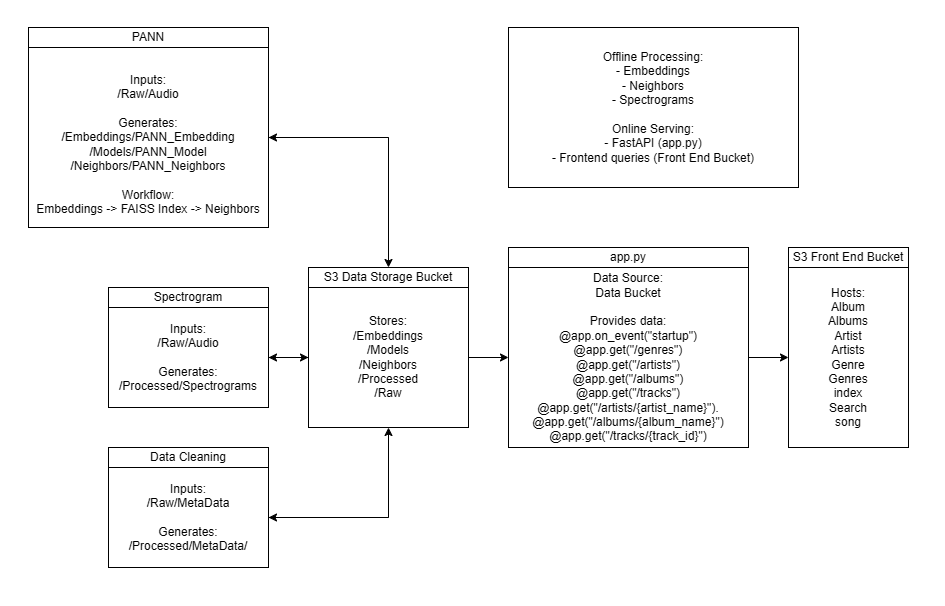

<<<<<<< Updated upstream
# Music Similarity model
Website Live: [App Live Here](https://www.team1.app)

We will create and compare multiple models that compare the similarity of music tracks, and return the most similar song(s) as reccomendations. These results and data will be hosted on AWS and have a public facing web application for user interaction.
The models we are working on are SLAPP and PANN. These will provide neighbor data and embeddings that we can run a knn or cosine similarity on to generate a list of similar songs.

# Project Goal
- Create and compare multiple ML models against GAI measuring similarity between songs.
- Determine if GAI outperforms traditional ML models for finding song similarity in our data.
- Create and deploy a web application that allows users to interact with our model.

# Tools/Requirements
- Pyhton
- Pandas
- Numpy
- Pytorch
- SQL
- AWS S3/EC2
- Docker

# Data
Data obtained from [Free Music Archive (FMA)](https://github.com/mdeff/) 

>Data is in CSV formatting, and ready for import into pyhton using pandas
>Data needs cleaning and joining to be useful.
>Data has been transformed into specrograms to allow CNN processesing and embedding.

Download the data from [here](http://capstone-music-similarity.s3-website-us-east-1.amazonaws.com/)

=======
# Team-1: Music Similatiry Model

## Outline
Get data
Clean data
Upload to sql server

What questions can we ask that are interesting to expand on how are songs similar?

What features lead to the strongerest similartity rating?

Can humans even do this well?

## Technology 

AWS S3 bucket for data storage
EC2 (on free tier) for web app
Dashboard TBD

## Goals
Understand similarity between songs, and their features.
If possible out perform the GAI 

>>>>>>> Stashed changes
